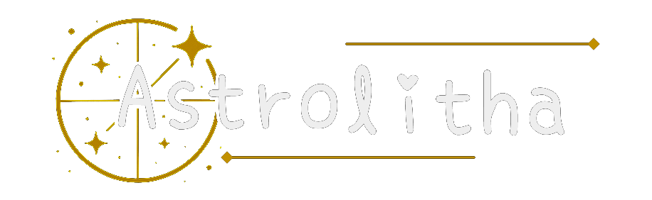
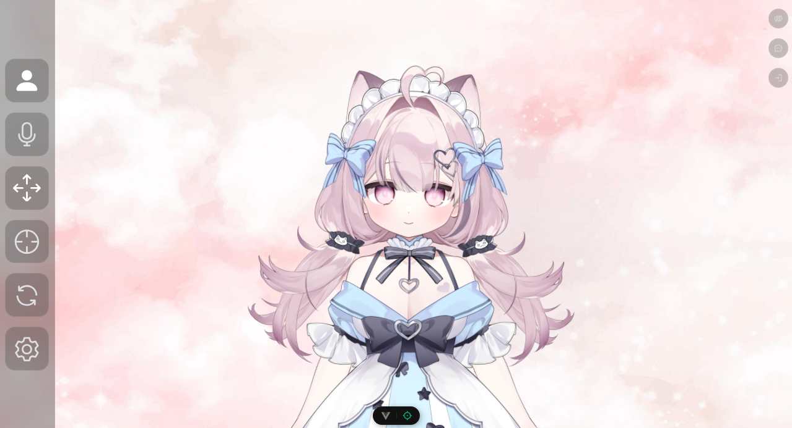
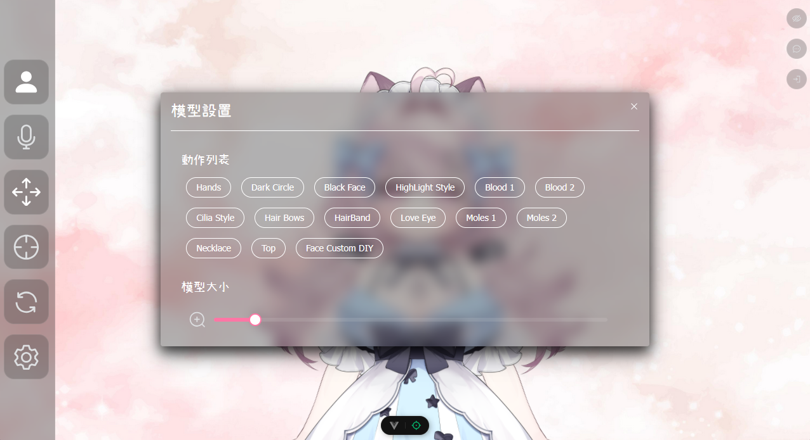
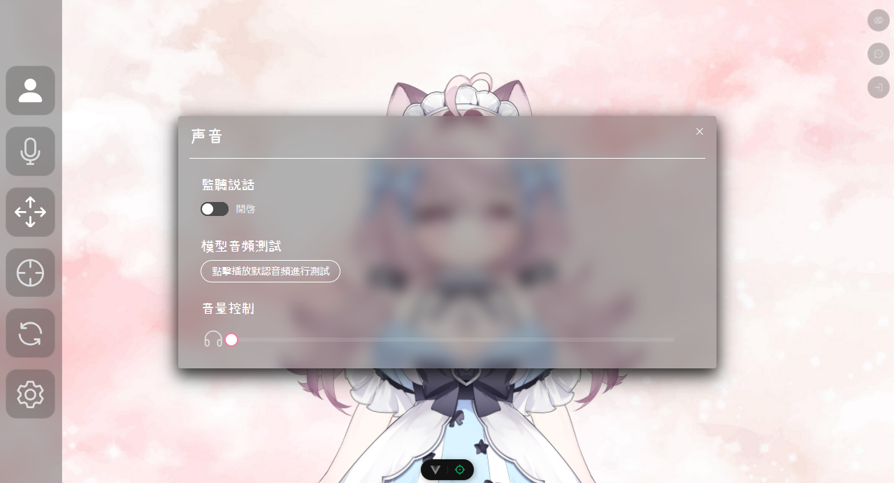
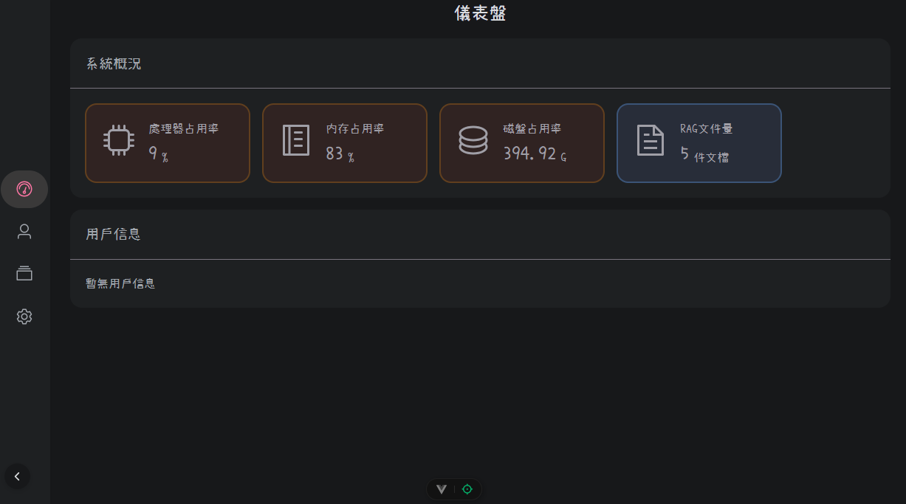
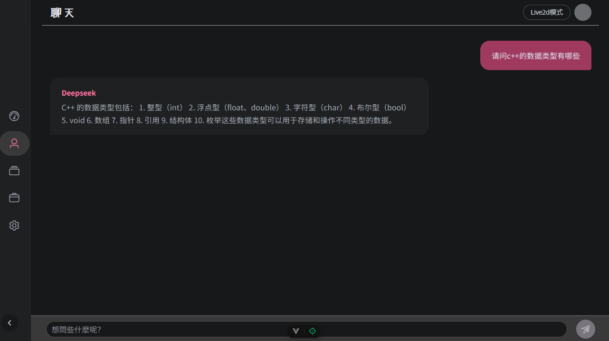
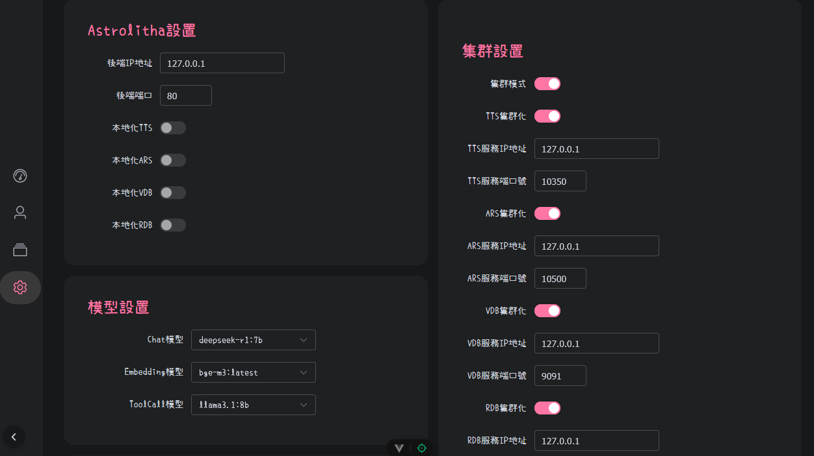
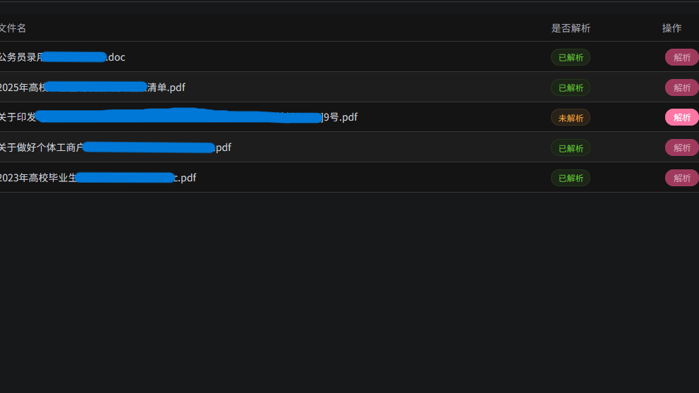
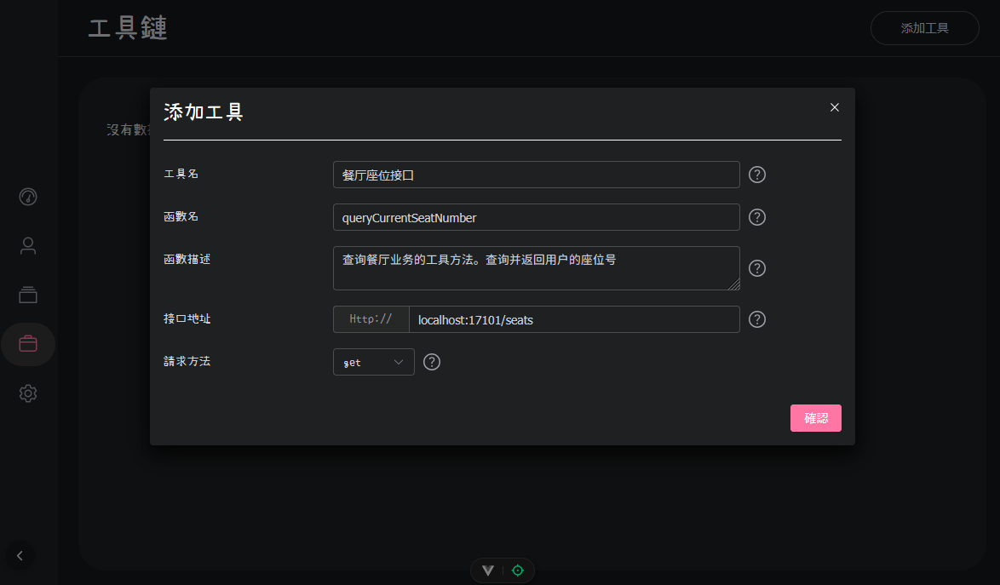
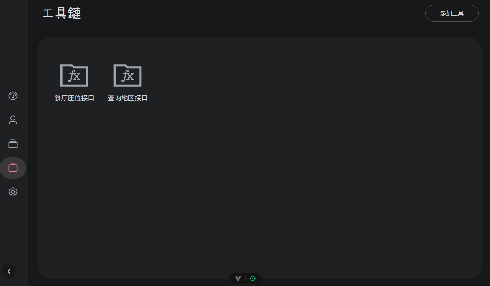

<div align="center">
    
<hr>

This is a distributed AI project based on Spring

[](https://github.com/Myazusa/Astrolitha/blob/main/LICENSE)


**English** | [**简体中文**](./docs/cn/README.md)

</div>

## Preview
Main interface

| <br>Live2D Display | <br>Expression Control | <br>Voice Control |
|:----------------------------------------------------------------------------:|:-------------------------------------------------------------------------------------:|:-------------------------------------------------------------------------:|


Dashboard and normal chat and options

|<br>Dashboard| <br>LLM Chat |<br>Options|
|:----------------------------------------------------------------------------:|:--------------------------------------------------------------------:|:----------------------------------------------------------------------------:|

RAG and toolchain

| <br>RAG Repository | <br>Add Tool | <br>Toolchain |
|:-------------------------------------------------------------------------:|:------------------------------------------------------------------------:|:---------------------------------------------------------------------:|


## Features

Base Features:
- **RAG service:** Provides self-built RAG, Including parsing docx and other files and VDB storage.
- **Live2D display driven by LLM:** Select any Live2D model to display, And the movements and speech are controlled by LLM.
- **Integrate TTS, ARS and LLM:** Call LLM through ARS and use ARS to generate speech at the end.
- **Agent support:** The large model can use function call the appropriate tools to perform corresponding operations according to the requirements given by the user.
- **Distributed support:** Supports deployment using Kubernetes. 

New Features：
- **Custom toolchain:** Supports calling interfaces of other projects as tools for the project model through Java reflection.

## Installation

### Windows
1. Download [Docker Desktop](https://www.docker.com/products/docker-desktop/).
2. Clone the project at the desired location.
    ```bash
        git clone https://github.com/Myazusa/Astrolitha.git
        cd Astrolitha
    ```
3. Run docker-compose.yaml.
    ```bash
        docker-compose up -d
    ```

### Linux
1. Install Docker Desktop.For details, please see [Docker Docs](https://docs.docker.com/desktop/setup/install/linux/)
2. Set up Docker service to start automatically.
    ```bash
        sudo systemctl enable docker
        sudo systemctl start docker
    ```
3. Check if there is NVIDIA driver.
    ```bash
        nvidia-smi
    ```
4. Install graphics card dependencies.
    ```bash
        sudo apt-get update
        sudo apt-get install -y curl gnupg ca-certificates
    
    distribution=$(. /etc/os-release;echo $ID$VERSION_ID) \
      && curl -s -L https://nvidia.github.io/libnvidia-container/gpgkey | \
         sudo gpg --dearmor -o /etc/apt/keyrings/nvidia-container-toolkit.gpg \
      && curl -s -L https://nvidia.github.io/libnvidia-container/$distribution/libnvidia-container.list | \
         sed 's#deb #deb [signed-by=/etc/apt/keyrings/nvidia-container-toolkit.gpg] #' | \
         sudo tee /etc/apt/sources.list.d/nvidia-container-toolkit.list
    ```
5. Install NVIDIA toolkit and runtime.
    ```bash
      sudo apt-get update
      sudo apt-get install -y nvidia-container-toolkit
      sudo nvidia-ctk runtime configure --runtime=docker
      sudo systemctl restart docker
    ```
6. Clone the project at the desired location.
    ```bash
        git clone https://github.com/Myazusa/Astrolitha.git
        cd Astrolitha
    ```
7. Run docker-compose.yaml.
    ```bash
        docker-compose up -d
    ```
### Mac
1. Promise me you won’t use Mac to run LLM projects, okay?

## Finish
Great, now you can use all the features in your browser.
```bash
    http://localhost:80
```

## Microservice
The project uses the following docker images as microservices.

- mysql:latest
- ollama/ollama:latest
- whisper:latest
- breakstring/gpt-sovits:v4
- milvusdb/etcd:latest
- minio/minio:latest
- milvus-standalone

Corresponding to the following open source projects.

- [mysql](https://github.com/mysql/mysql-server)
- [ollama](https://github.com/ollama/ollama)
- [whisper](https://github.com/openai/whisper)
- [gpt-sovits](https://github.com/RVC-Boss/GPT-SoVITS)
- [milvus](https://github.com/milvus-io/milvus)

## License
This project is a finished application rather than a tool library or framework, so it uses the AGPLv3 open source protocol instead of MIT or Apache 2.0.

- For personal: fully supports personal use without any restrictions, you can modify the source code at will without making it public.
- For commercial: you can use the original project without modification to provide services to the outside world, and the income you get belongs to you. If you have to modify the project, you need to open source the modified code at the same time. If it is closed source and not published, you need to apply for authorization from the source project author.

If you encounter problems, you are welcome to raise an issue in this project or become a project contributor!